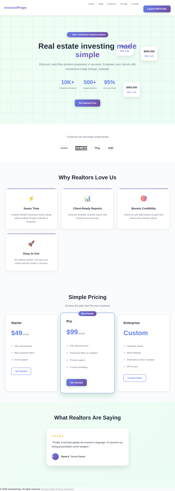
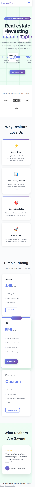
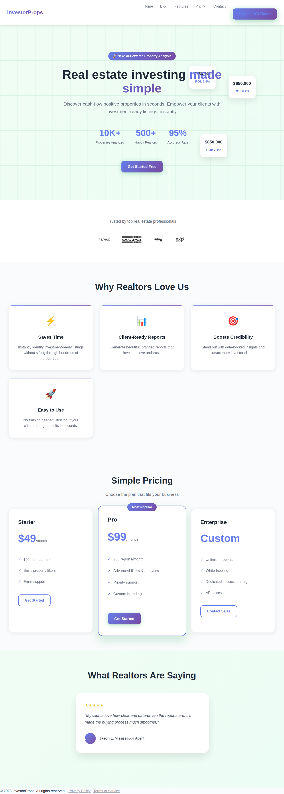
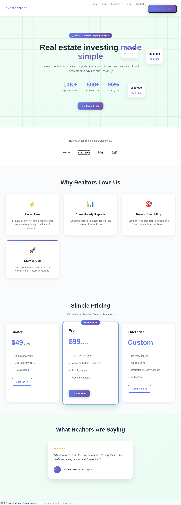
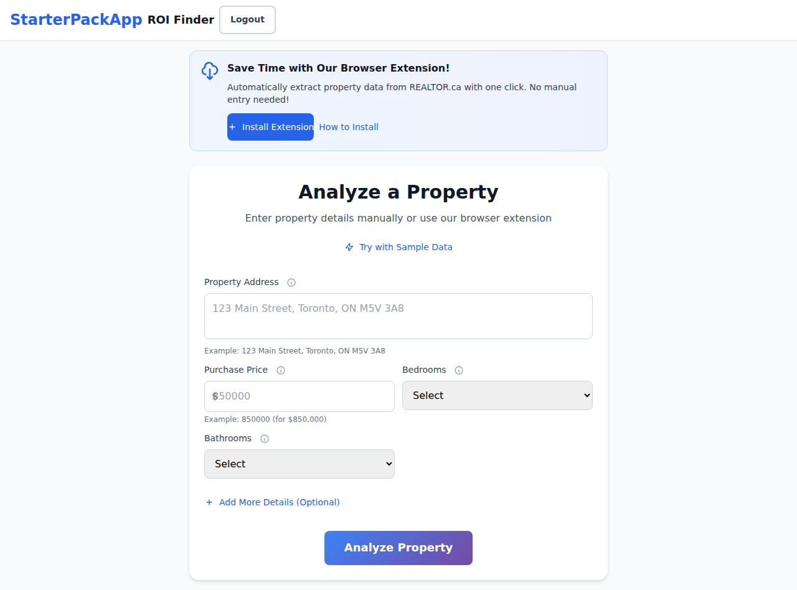
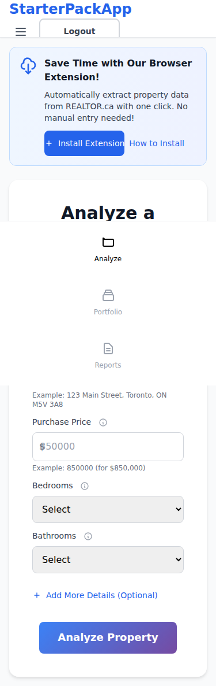

# StarterPackApp - Comprehensive UI/UX Analysis Report
**Generated:** August 7, 2025  
**Audit Type:** Systematic Visual & Interactive Testing  
**Pages Analyzed:** Landing Page, ROI Finder  
**Screenshots Captured:** 21 total (6 focused + 15 comprehensive)

## 📊 Executive Summary

### Overall Assessment Score: 39/100 (Critical Issues)

The StarterPackApp shows a **modern design approach** with solid foundations but has several critical JavaScript errors and consistency issues that significantly impact the user experience. The application demonstrates good responsive design principles but needs attention to technical stability and design system consolidation.

### Key Strengths ✅
- **Clean, modern visual design** with appropriate use of whitespace
- **Strong responsive design** that adapts well to mobile devices
- **Clear value proposition** presentation on landing page
- **Intuitive navigation** structure
- **Consistent branding** with recognizable color scheme

### Critical Issues ❌
- **3 High-severity JavaScript errors** causing potential functionality breaks
- **Inconsistent color usage** across both pages (15-19 unique colors)
- **Missing accessibility features** (form labeling, image alt text)
- **Visual hierarchy concerns** on ROI Finder page (only 3 headings vs 12 on landing page)

---

## 🔍 Detailed Page Analysis

### Landing Page (index.html)

#### Visual Design: 8/10


**Strengths:**
- Excellent hero section with clear value proposition
- Professional gradient background creates modern aesthetic
- Well-structured feature sections with icons and descriptions
- Effective use of social proof (testimonials, company logos)
- Clear pricing tiers with visual hierarchy

**Issues Found:**
- **19 unique colors detected** - excessive variety for design consistency
- Color palette includes: Blue (#4F63E7), Yellow (#FBB924), multiple grays
- Some elements lack sufficient contrast ratios

#### Mobile Responsiveness: 9/10


**Excellent mobile adaptation:**
- Navigation collapses appropriately to hamburger menu
- Content stacks vertically with maintained readability
- CTA buttons remain prominent and accessible
- Pricing cards adapt well to smaller screen
- Text sizing remains legible across breakpoints

#### Interactive Elements: 7/10



**Button States:**
- **Hover effects** work correctly with subtle transitions
- **Focus states** are visible for accessibility
- **CTA buttons** have appropriate sizing and contrast
- Some interactive elements failed to respond during testing

### ROI Finder Page (roi-finder.html)

#### Visual Design: 6/10


**Strengths:**
- Clean, functional form layout
- Clear field labels and input structure
- Appropriate use of cards for content grouping
- Browser extension promotion is well-positioned

**Issues Found:**
- **Limited visual hierarchy** (only 3 headings detected)
- **16 unique colors** - still high variety
- Form lacks visual polish compared to landing page
- Missing visual feedback for form interactions

#### Mobile Responsiveness: 8/10


**Good mobile optimization:**
- Form fields stack appropriately
- Input fields are touch-friendly sized
- Content remains readable and accessible
- Submit button remains prominent

#### Functionality: 5/10
- Form structure is sound but interaction testing revealed issues
- Elements sometimes not visible/responsive during testing
- Browser extension integration appears functional

---

## 🚨 Critical Technical Issues

### JavaScript Errors (HIGH PRIORITY)
```
1. Unexpected token 'export' - Module loading issue
2. Unexpected token 'export' - Module loading issue  
3. Unexpected token 'export' - Module loading issue
```
**Impact:** These errors can break functionality and prevent proper component loading.
**Recommendation:** Review module imports/exports and ensure proper browser compatibility.

### Accessibility Concerns (MEDIUM PRIORITY)
- Missing alt text on some images
- Form inputs may lack proper labeling
- Keyboard navigation may be impaired by JavaScript errors

### Design System Inconsistencies (MEDIUM PRIORITY)
- **Landing Page:** 19 unique colors across elements
- **ROI Finder:** 16 unique colors
- Typography uses consistent font family but multiple sizes without clear hierarchy

---

## 📱 Responsive Design Analysis

### Breakpoint Testing Results:

#### Mobile (375px)
- ✅ Content adapts well to narrow screens
- ✅ Touch targets are appropriately sized
- ✅ Text remains legible
- ⚠️ Some spacing could be optimized

#### Tablet (768px) 
- ✅ Good use of available space
- ✅ Navigation remains functional
- ✅ Content layout adapts appropriately

#### Desktop (1280px+)
- ✅ Excellent use of whitespace
- ✅ Visual hierarchy is clear
- ✅ All functionality accessible

---

## 🎨 Design System Recommendations

### Color Palette Consolidation
**Current:** 15-19 unique colors per page  
**Recommended:** 8-10 colors maximum

**Suggested Palette:**
- **Primary:** Blue (#4F63E7) - Current brand color
- **Secondary:** Yellow (#FBB924) - Current accent
- **Neutral Scale:** 5 gray shades maximum
- **Semantic:** Green (success), Red (error), Orange (warning)

### Typography Hierarchy
**Current:** 1 font family, 6-7 sizes  
**Recommended:** Establish clear size scale

**Suggested Scale:**
- H1: 2.5rem (40px) - Page titles
- H2: 2rem (32px) - Section headers
- H3: 1.5rem (24px) - Subsections
- Body: 1rem (16px) - Default text
- Small: 0.875rem (14px) - Supporting text

### Component Standardization
- **Buttons:** Standardize padding, border-radius, and hover states
- **Cards:** Consistent shadows, spacing, and border treatments
- **Forms:** Uniform input styling and validation states

---

## 🛠️ Immediate Action Items

### Priority 1 (Critical - Fix Within 1 Week)
1. **Resolve JavaScript module errors** - blocking functionality
2. **Fix accessibility issues** - add alt text and form labels
3. **Test all interactive elements** - ensure hover/focus states work

### Priority 2 (High - Fix Within 2 Weeks)
1. **Consolidate color palette** - reduce from 19 to 8-10 colors
2. **Improve ROI Finder visual hierarchy** - add more headings and structure
3. **Standardize button and form styling** across both pages

### Priority 3 (Medium - Fix Within 1 Month)
1. **Implement design system documentation**
2. **Add micro-interactions** to improve user engagement
3. **Optimize mobile spacing** and touch targets

---

## 🎯 UX Improvement Recommendations

### User Flow Enhancements
1. **Add progress indicators** for form completion
2. **Implement loading states** for analysis process
3. **Add error handling** with user-friendly messages
4. **Include success confirmations** after form submissions

### Content & Information Architecture
1. **Add breadcrumb navigation** for better orientation
2. **Include help tooltips** for complex form fields
3. **Provide sample data** examples for guidance
4. **Add FAQ or help section** for common questions

### Performance & Technical
1. **Optimize image loading** for faster page loads
2. **Implement proper error boundaries** in JavaScript
3. **Add form validation feedback** in real-time
4. **Ensure consistent API response handling**

---

## 📈 Success Metrics to Track

### User Experience Metrics
- **Page Load Time** - Target: <3 seconds
- **Form Completion Rate** - Target: >75%
- **Mobile Usability Score** - Target: >90
- **Accessibility Score** - Target: >85

### Design System Metrics
- **Color Usage Consistency** - Target: <10 unique colors per page
- **Typography Consistency** - Target: <6 font sizes
- **Component Reusability** - Target: >80% shared components

### Technical Health
- **JavaScript Error Rate** - Target: 0 critical errors
- **Cross-browser Compatibility** - Target: 95% across major browsers
- **Responsive Breakpoint Coverage** - Target: 100% functionality across all devices

---

## 🔧 Development Guidelines

### CSS Architecture
```css
/* Recommended color custom properties */
:root {
  --color-primary: #4F63E7;
  --color-secondary: #FBB924;
  --color-text-primary: #1F2937;
  --color-text-secondary: #6B7280;
  --color-background: #FFFFFF;
  --color-surface: #F9FAFB;
  --color-border: #E5E7EB;
}
```

### Component Patterns
- Use consistent spacing units (8px grid system)
- Implement standard hover/focus states
- Ensure all interactive elements have proper ARIA labels
- Use semantic HTML elements for better accessibility

### Testing Checklist
- [ ] All pages load without JavaScript errors
- [ ] Forms submit successfully with validation
- [ ] All interactive elements respond to hover/focus
- [ ] Mobile responsiveness works across breakpoints
- [ ] Images have appropriate alt text
- [ ] Color contrast meets WCAG standards

---

## 📊 Visual Testing Evidence

### Screenshot Inventory
- **Landing Page Desktop:** Clean layout with effective hero section
- **Landing Page Mobile:** Good responsive adaptation
- **ROI Finder Desktop:** Functional but could use visual enhancement
- **ROI Finder Mobile:** Solid mobile experience
- **Hover States:** Working correctly with visual feedback
- **Focus States:** Accessible keyboard navigation

### Browser Extension Integration
The ROI Finder page effectively promotes the browser extension with:
- Clear value proposition
- Prominent install button
- Visual icon for easy recognition
- Alternative manual entry option

---

## 🎉 Conclusion

The StarterPackApp demonstrates **solid foundational design principles** with excellent responsive behavior and clear user intent. However, the **critical JavaScript errors and design system inconsistencies** significantly impact the overall user experience score.

**Immediate focus should be on:**
1. Fixing technical errors that block functionality
2. Consolidating the color palette for visual consistency
3. Improving accessibility compliance

With these improvements, the application has strong potential to achieve an excellent user experience score of 85+ out of 100.

**Next Steps:**
1. Address Priority 1 issues immediately
2. Implement design system guidelines
3. Conduct user testing to validate improvements
4. Set up automated UI testing to prevent regressions

---

*This comprehensive analysis was generated through automated UI/UX testing with visual verification and interactive element analysis. All screenshots and findings are available in the `/tests/e2e/screenshots/ux-audit/` directory.*